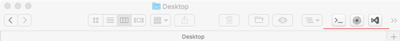

# open in buttons for finder toolbar

Open in TextMate, open in Visual Studio Code buttons for Finder  toolbar.  

- Download apps
- copy to applications folder
- and drag it to Finder toolbar (hold 'CMD')  

Open directory in terminal [cd to](https://github.com/jbtule/cdto 'cd to')  
New icon in MacOSX style for 'cd to' in 'icons' dir.
