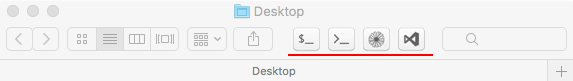
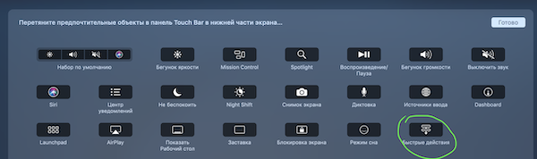

# 'open in' buttons for MacOS X Finder toolbar and MB Pro touchbar

I have made it because couldn't find any useful and easy to extend alternative. I hope it is helpful for you, to.o  
For now I'm just using extensions for touchbar. Thats why extensions for Finder toolbar may not work correctly and have only light icons (looks ugly with dark mode). However you can always fork it and fix it.  

## Finder toolbar

## Macbook Pro Touch Bar

  

## Available apps

- Terminal
- iTerm
- TextMate
- Visual Studio Code (you can also check https://github.com/hamxiaoz/open-folder-with-vs-code)
- Sublime Text (you can also check https://github.com/hamxiaoz/open-folder-with-sublime)
- Atom

## How to
### TouchBar. 
Open System Preferences -> Keyboard -> Customize Touch Bar and add Quick Action button to touch bar.  

  

Then open `*.workflow` files from `scr/touchbar` and save them.  
Or copy `*.workflow` files to `~/Library/Services`

### Finder Toolbar 
- Download apps
- Copy to applications folder
- and drag it to Finder toolbar (hold `⌘cmd`)

## Sublime Text
Read [this topic](https://gist.github.com/artero/1236170 "this topic") before run "open-in-Sublime" app.  
Also check this repo - https://github.com/hamxiaoz/open-folder-with-sublime  

## TextMate
Read [this](https://manual.macromates.com/en/using_textmate_from_terminal.html "this") before run the app 

## How it works? How to change something?

Take a look in `src` folder
